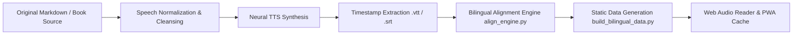

# TechVoice · AI Agents in Depth: Bilingual Audio Reader

<div align="center">

**English** • [中文简体](README_zh.md)

<br>

[](https://github.com/bojieli/ai-agent-book)
[](https://github.com/bojieli/ai-agent-book)
[](https://github.com/bojieli/ai-agent-book)
[](https://github.com/bojieli/ai-agent-book)
[-emerald.svg?style=flat-square)](#)
[](#license--acknowledgments)

<p align="center">
  <b>Turn heavyweight open-source engineering books into pleasant audio companions.</b><br>
  Complete 12 chapters, 20 hours 56 minutes of high-fidelity English narration, paired with 8,052 sentence-aligned bilingual subtitles and 293 hierarchical sub-chapter navigation landmarks.
</p>

[🌐 Web Reader](#quick-start--local-preview) • [📖 Chapter Directory](#chapter-breakdown--durations) • [✨ Key Features](#key-features) • [🛠️ Audio Pipeline](#audio-synthesis--alignment-pipeline) • [⌨️ Shortcuts](#keyboard-shortcuts)

</div>

---

> [!IMPORTANT]
> ### 📌 Attribution & Independent Creation Disclaimer
> 
> * **Original Book Authorship & Copyright**: The original book *《深入理解 AI Agent：设计原理与工程实践》* (*AI Agents in Depth: Design Principles and Engineering Practice*) is authored by and copyrighted by **Dr. Bojie Li** (Co-Founder & Chief Scientist of Pine AI, adjunct lecturer at UCAS, former Principal Researcher at Microsoft Research Asia).
>   * Official GitHub Repository: [github.com/bojieli/ai-agent-book](https://github.com/bojieli/ai-agent-book)
>   * Official Online Astro Reader: [bojieli.github.io/ai-agent-book/astro/](https://bojieli.github.io/ai-agent-book/astro/)
>   * Official E-Book Releases (15 Languages EPUB & PDF): [GitHub Releases](https://github.com/bojieli/ai-agent-book/releases)
> * **Independent Audio Edition**: The **English audio narration, sentence-by-sentence temporal alignment data, and interactive web player in this repository were independently created and compiled by the site owner**. This is **not an official release by the original book author**. It was produced as a personal learning initiative to listen to open-source technical books during walks and commutes while sharpening technical English listening and systems design skills.

---

## 🎧 Project Overview

Modern Large Language Models (LLMs) and autonomous agents are advancing at exponential velocity. Dr. Bojie Li's seminal book introduces the foundational architecture:
$$\text{Agent} = \text{LLM} (\text{Brain}) + \text{Context} (\text{Eyes}) + \text{Tools} (\text{Hands \& Feet})$$
alongside the engineering harness loop:
$$\text{Agent} = \text{Model} + \text{Harness} (\text{Constraint} + \text{Verification} + \text{Error Correction})$$

To make this comprehensive 400+ page monograph accessible on-the-go—during daily commutes, walks, or gym sessions—this project converted all 12 chapters into natural English speech and built a lightweight, distraction-free **bilingual synchronized web reader**.

---

## ✨ Key Features

### 1. Three Reading Modes
* **Bilingual View (中英双语)**: Side-by-side or stacked English narration with aligned Chinese translation. Active sentence highlights dynamically in sync with audio playback.
* **English Immersion (纯英文)**: Hides Chinese text for pure, native-level technical listening practice.
* **Chinese Overview (纯中文)**: Hides English subtitles to skim through core architectural concepts quickly in Chinese.

### 2. Temporal Precision & Sentence-Looping
* **Smart Auto-Scroll**: Active sentences smoothly auto-scroll into the screen's golden reading zone. Manually scrolling temporarily disengages auto-scroll to allow browsing; one click instantly re-locks tracking.
* **Single-Sentence Repeat (A-B Loop, Key: <kbd>R</kbd>)**: Encounter unfamiliar jargon or complex system terminology? Press `R` to loop the current sentence indefinitely until fully grasped.
* **Millisecond Click-to-Seek**: Click any sentence card in the transcript to jump playback directly to that millisecond.

### 3. 293 Hierarchical Sub-Chapter Landmarks
* **Decimal Outline Tree**: Sidebar organizes sections with hierarchical decimal numbers (`1.1`, `1.1.1`), allowing instant folding/expansion of subsections.
* **Seekbar Milestone Ticks**: Audio progress bar features visual tick marks for every sub-chapter, with tooltip previews on hover.
* **Section Divider Cards & Sticky Pills**: Prominent visual cards split subsections in the transcript, accompanied by a horizontally-scrollable top pill bar for swift section jumping.

### 4. Offline Ready & Standalone Files
* **PWA / One-Click Chapter Caching**: Built with CacheStorage and Service Workers. Hit "Cache Chapter" to save audio locally for flights or network dead-zones.
* **Standard Offline Media**: The repository root includes complete, standard `.mp3` audio tracks and matching `.srt` / `.vtt` subtitle files, ready for import into podcast apps or mobile media players.

### 5. Fast, Clean & Privacy-First
* Zero tracking, zero ads, no login required. Instant static page load.
* Full dark mode / light mode theme support.
* Comprehensive UI internationalization (toggle between English and Chinese interface anytime).

---

## 📖 Chapter Breakdown & Durations

| # | Chapter | Title (EN) | Title (ZH) | Duration | Sentences (Cues) | Sub-Sections |
|:---:|:---|:---|:---|:---:|:---:|:---:|
| **0** | Introduction | Practice Precedes Naming | 实践在前，命名在后 | 26:16 | 160 | 5 |
| **1** | Chapter 1 | Getting Started with AI Agents | 初识 AI Agent | 89:29 | 574 | 17 |
| **2** | Chapter 2 | Context Engineering | 上下文工程 | 142:17 | 974 | 42 |
| **3** | Chapter 3 | User Memory and Knowledge Bases | 用户记忆与知识库 | 123:22 | 755 | 25 |
| **4** | Chapter 4 | Tools and Protocols | 工具系统与协议 | 89:49 | 545 | 17 |
| **5** | Chapter 5 | Coding Agents and General-Purpose Agents | 代码智能体与通用智能体 | 140:26 | 902 | 20 |
| **6** | Chapter 6 | Interaction: Expanding Observation & Action Spaces | 交互：拓展观察与动作空间 | 114:12 | 779 | 35 |
| **7** | Chapter 7 | Evaluating Agents | Agent 评测 | 138:56 | 879 | 45 |
| **8** | Chapter 8 | Model Post-Training | 模型后训练 | 171:02 | 1045 | 41 |
| **9** | Chapter 9 | Continual Evolution of Agents | Agent 持续演进 | 84:00 | 536 | 14 |
| **10** | Chapter 10 | Multi-Agent Collaboration | 多 Agent 协作 | 124:08 | 822 | 29 |
| **11** | Afterword | Afterword: Co-Evolution of Two Clouds | 后记：两朵云的协同演化 | 12:19 | 81 | 3 |
| **Σ** | **Total** | **12 Chapters** | **12 个完整章节** | **20h 56m 21s** | **8,052 Cues** | **293 Sections** |

---

## ⌨️ Keyboard Shortcuts

On the reader interface (`reader.html`), the following desktop shortcuts are supported:

| Key | Action |
|:---|:---|
| <kbd>Space</kbd> | Play / Pause audio playback |
| <kbd>←</kbd> | Rewind 5 seconds |
| <kbd>→</kbd> | Fast-forward 5 seconds |
| <kbd>↑</kbd> | Jump to previous subtitle sentence |
| <kbd>↓</kbd> | Jump to next subtitle sentence |
| <kbd>R</kbd> | Toggle single-sentence repeat loop (A-B Loop) |
| <kbd>Esc</kbd> | Close current modal dialog |

---

## 🛠️ Audio Synthesis & Alignment Pipeline

In addition to the front-end player, this repository includes the complete engineering pipeline used to normalize, synthesize, and align technical books:



### Pipeline Script Highlights
* **`audio_pipeline.py`**: Handles text chunking, formatting cleanup, LaTeX formula speech expansion, code block vocalization, and batch Neural TTS audio generation.
* **`align_engine.py`**: Sentence-level alignment engine utilizing dynamic boundary matching to anchor English audio timestamps 1-to-1 against Chinese translations.
* **`build_bilingual_data.py`**: Compiles raw subtitle files and section metadata into optimized JavaScript static payloads (`data/chapter*.js`).
* **`data/sections_meta.json`**: Indexed database of 293 hierarchical sub-chapters, timing anchors, and headings.

---

## 🚀 Quick Start & Local Preview

Built strictly with vanilla web technologies (HTML5, CSS3, ES6 JavaScript). Zero build steps, zero node_modules, and zero backend required.

### 1. Clone the repository
```bash
git clone https://github.com/<your-username>/ai-agent-audiobook.git
cd ai-agent-audiobook
```

### 2. Start a local static file server
Run with Python 3, Node.js, or any static file server:

```bash
# Python 3
python3 -m http.server 8000

# or Node / npx
npx serve .
```

### 3. Open in your browser
* **Library Homepage**: `http://localhost:8000/index.html`
* **Direct Player**: `http://localhost:8000/reader.html#chapter1`

---

## 📂 Project Directory Structure

```text
├── index.html                   # Monograph landing page (overview, chapter selector, resources)
├── reader.html                  # Bilingual audio listening application
├── css/
│   ├── style.css                # Audio reader design system, layout, and responsive rules
│   └── landing.css              # Monograph landing page styles
├── js/
│   ├── app.js                   # Reader controller (audio sync, auto-scroll, shortcuts, caching)
│   └── i18n.js                  # Complete bilingual internationalization dictionaries (EN/ZH)
├── data/
│   ├── chapters_meta.js         # Metadata for 12 chapters and sub-chapter hierarchies
│   ├── sections_meta.json       # 293 sub-chapter timestamp mappings
│   ├── introduction.js          # Introduction bilingual sentence cues
│   ├── chapter1.js ~ chapter10.js # Chapters 1 to 10 bilingual sentence cues
│   └── afterword.js             # Afterword bilingual sentence cues
├── assets/                      # Icons, vector badges, and visual assets
├── *.mp3                        # Full-length offline audio files for all 12 chapters
├── *.vtt / *.srt                # Standard subtitle tracks with millisecond timestamps
├── align_engine.py              # Sentence-level timestamp alignment engine
├── audio_pipeline.py            # Neural TTS synthesis and preprocessing pipeline
├── build_bilingual_data.py      # Build tool compiling data bundles for web player
├── sw.js                        # Service Worker for offline PWA chapter caching
├── README.md                    # English documentation (this file)
└── README_zh.md                 # Chinese documentation
```

---

## 🔗 Official Book Links & Resources

* **Author GitHub**: [Dr. Bojie Li (@bojieli)](https://github.com/bojieli)
* **Official Book Repository**: [bojieli/ai-agent-book](https://github.com/bojieli/ai-agent-book)
* **Official Online Astro Reader**: [bojieli.github.io/ai-agent-book/astro/](https://bojieli.github.io/ai-agent-book/astro/)
* **Official E-Book Releases (15 Languages)**: [GitHub Releases](https://github.com/bojieli/ai-agent-book/releases)

---

## 📄 License & Acknowledgments

* The book *《深入理解 AI Agent：设计原理与工程实践》* (*AI Agents in Depth*) is copyrighted by **Dr. Bojie Li** and distributed under open-source terms.
* The web reader application, UI design system, and alignment scripts in this repository are released under the [MIT License](LICENSE).
* Please consider giving a ⭐️ Star to Dr. Bojie Li's official repository [bojieli/ai-agent-book](https://github.com/bojieli/ai-agent-book) to support his outstanding open-source contributions!
